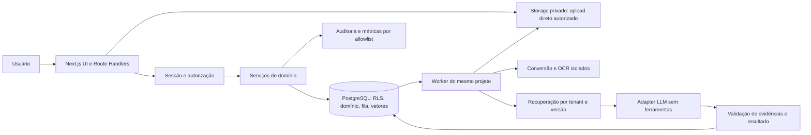

# Implementation Plan: MVP de Revisão e Aprovação de RFPs/RFIs

**Branch**: `001-review-rfp-rfi` | **Date**: 2026-09-30 | **Spec**: [spec.md](spec.md)

**Input**: Specification atual, Constitution v1.1.0 e instruções de planejamento fornecidas pelo usuário.
**Estado**: Design técnico das fases 0 e 1 concluído; implementação e validação de produto ainda não executadas.

## Summary

Manter um monólito modular Next.js, com frontend e backend no mesmo projeto e um worker Node no mesmo repositório para processamento demorado. PostgreSQL mantém domínio, fila e busca vetorial; Supabase gerencia banco, autenticação e objetos privados. O worker executa extração, OCR, indexação, recuperação, geração e exportação. Nenhum modelo tem ferramentas para aprovar, mudar permissões ou exportar.

O fluxo é upload privado → validação → extração e eventual conferência humana de OCR → conhecimento indexado/perguntas → recuperação isolada por organização → sugestão com evidências → revisão → aprovação humana de versão estável → exportação autorizada → histórico. Originais, versões e proveniência são preservados.

A spec permanece a fonte funcional. As prioridades P1/P2 das *jornadas* não retiram os requisitos F do MVP, que a própria spec declara P0. Não acrescentar funcionalidades futuras, chat, integrações corporativas, dashboards avançados ou autoaprovação. “Integrações externas fora do MVP” significa integrações de produto; infraestrutura de identidade, armazenamento e IA é necessária ao escopo autorizado.

## Technical Context

**Language/Version**: TypeScript 5; Node.js 24; Next.js 16.3.6 e React 19.2.8 já instalados. Manter lockfile; novas dependências serão fixadas na implementação após compatibilidade e análise de licença.

**Primary Dependencies**: Tailwind 4, Base UI/shadcn existentes; `pg`, Zod, Graphile Worker, Supabase Auth/Storage SDK; `pdfjs-dist`, LibreOffice headless, Tesseract com por/eng, ClamAV, ExcelJS e `docx`; SDK OpenAI, pgvector; editor Tiptap limitado a texto/negrito/itálico/listas. Sem framework de agentes ou orquestrador RAG adicional.

**Storage**: PostgreSQL gerenciado com pgvector; migrations SQL versionadas. Schemas privados `app` e fila, sem Data API para tabelas de domínio. Objetos privados e imutáveis no Supabase Storage. Nenhum arquivo corporativo no Git ou diretório público.

**Testing**: Vitest (unidade/contrato), banco real local (integração/RLS), Playwright e axe (E2E/acessibilidade), conjunto de avaliação RAG versionado com fixtures sintéticas. Sem credenciais reais na CI comum.

**Target Platform**: Linux containers, web e worker separados operacionalmente mas compartilhando código e release. Um host/container platform no piloto; banco e storage gerenciados. HTTPS, conexão direta/session pool do banco para worker; sem requisição HTTP longa para processamento.

**Project Type**: aplicação web B2B multi-tenant, desktop-first, interface pt-BR, documentos/perguntas pt/en.

**Performance Goals**: instrumentar SC-004–SC-009; SC-007 mantém meta de redução ≥60% no piloto. SC-012 (100 itens, p95 ≤1 s na troca) é cenário proposto, não SLA aprovado. TTFV medido sem target. Validar orçamento técnico de recursos com fixtures, sem inventar volume comercial.

**Constraints**: 50.000.000 bytes/arquivo; PDF/DOCX/XLSX/PPTX; PDFs digitalizados exigem conferência humana; 120 dias de aging; RBAC e gates determinísticos; telemetria sem texto corporativo. OCR/LLM não podem transformar falha em “sem contexto”.

**Scale/Scope**: piloto multi-organização; teste mínimo com dois tenants e três papéis, 100 itens como fixture de desempenho. Sem promessa de número máximo de organizações/documentos. Concorrência inicial do worker: 2 trabalhos, no máximo 1 conversão/OCR por processo; ajustar por medidas. Esses valores são configurações operacionais, não limites de plano comercial.

## Constitution Check

Gates avaliados antes da pesquisa e novamente após o design. Nenhuma exceção solicitada.

| Princípio | Antes da pesquisa | Evidência no design final | Resultado pós-design |
| --- | --- | --- | --- |
| I Clareza/manutenção | Exigir módulos pequenos | Domínio por capacidade e adapters concretos; sem framework genérico | PASS |
| II Modularidade/regras determinísticas | Separar modelo e comandos críticos | Transações, RLS, comandos de workflow; worker sem permissão de aprovação | PASS |
| III Testes proporcionais | Priorizar isolamento/aprovação | Matriz no quickstart, banco real e concorrência adversarial | PASS no design; execução pendente |
| IV IA rastreável/incerteza | Nenhuma evidência inventada | Contrato estruturado, referências validadas, versões e avaliação RAG | PASS no design; calibração P-01 bloqueia release de IA |
| V Controle humano | Aprovação explícita por versão | Revisão, confirmação crítica e aprovação independentes | PASS |
| VI Segurança/privacidade | Tenant desde a entrada | RLS restritiva, objetos privados, validação, secrets no servidor | PASS no design; P-03 bloqueia dados reais |
| VII Rastreabilidade | Eventos sem cópias em logs | Revisões imutáveis e auditoria transacional com IDs | PASS |
| VIII Falhas explícitas | Estados e recuperação | Jobs idempotentes, falha separada de ausência, retries limitados | PASS |
| IX Observabilidade | Allowlist de metadados | Tokens, tempos, tipos, IDs; sem prompts/respostas | PASS |
| X Reversibilidade | Incrementos verticais | Migrations aditivas, snapshots, rollback e versões de pipeline | PASS |
| XI DoD/governança | Testes bloqueiam entrega | Plano não declara implementação pronta; pendências e gates explícitos | PASS |

Tensões tratadas: credenciais privilegiadas de serviços não podem virar acesso geral ao domínio; `store:false` não promete retenção zero no provedor; converter Office não garante fidelidade ao original; validação de schema/citação não prova verdade semântica; OCR precisa confirmação humana; dois processos são necessários por CPU/duração, sem dois serviços de negócio. Os controles e testes correspondentes são obrigatórios.

## Project Structure

### Documentation (this feature)

```text
specs/001-review-rfp-rfi/
├── spec.md
├── plan.md
├── research.md
├── data-model.md
├── quickstart.md
├── tasks.md
└── contracts/
    ├── application.md
    ├── pipeline.md
    └── lifecycle.md
```

`tasks.md` contém a decomposição executável deste plano; `contracts/lifecycle.md` detalha encerramento, recuperação histórica e exclusão.

### Source Code (repository root)

Estrutura proposta, não implementada nesta etapa:

```text
src/
├── app/                      # rotas existentes + (workspace), auth, api/v1
├── components/ui/            # compartilhados com /design-system
├── components/brand/
├── components/features/      # revisão, fontes, OCR, base, tarefas
├── modules/
│   ├── identity/             # sessões, memberships, papéis e administração
│   ├── documents/            # uploads, versões, extração e conferência
│   ├── knowledge/            # chunks, recuperação e evidências
│   ├── proposals/            # tarefas, perguntas, progresso
│   ├── review/               # versões, leases, alertas e aprovação
│   ├── exports/              # snapshot, renderização, entrega
│   └── measurements/         # auditoria e métricas sem conteúdo
├── server/
│   ├── db/                   # transações, roles, tenant context
│   ├── auth/                 # Supabase sessão/invites
│   ├── storage/              # objetos privados
│   ├── ai/                   # embedding/generation adapters
│   ├── documents/            # conversão e OCR
│   └── jobs/                 # handlers da fila
├── worker/main.ts
└── styles/tokens.css
supabase/migrations/
scripts/                     # seeds sintéticos, evals, operações autorizadas
infra/                       # containers web/worker e configuração local
tests/                      # unit, integration, contract, e2e, evals, fixtures
```

**Structure Decision**: um projeto e um lockfile, sem monorepo ou microserviços. Regras puras não importam Next.js, Supabase nem SDK de IA. Entradas web usam DAL `server-only`; worker importa os mesmos serviços de aplicação por entrypoint Node, sem importar módulos exclusivos do runtime Next. As poucas portas substituíveis são AI, Storage e DocumentProcessor.

## Complexity Tracking

Sem violações constitucionais. Worker é justificado por OCR/conversão e trabalhos duráveis; PostgreSQL atende banco, fila e vetores, evitando Redis e banco vetorial dedicado no piloto.

## Arquitetura e responsabilidades



- Server Components obtêm DTOs mínimos por DAL. Client Components só para editor, split view, upload, conferência e polling. Sem cache compartilhado de conteúdo autenticado; respostas `private, no-store`. Guides locais de Next.js consultados: `data-security.md`, `15-route-handlers.md`. Autorização em cada entrada, nunca só em layout/proxy.
- Auth gerenciada por Supabase, com sessão validada no servidor e cookies seguros; login por e-mail com convite/OTP, sem atribuição de organização por domínio de e-mail. Papéis atuais vêm do banco, não de claims antigos. Administração é uma capacidade separada de Revisor/Aprovador. O fluxo inclui login de convidado, erros explícitos de código inválido/expirado, sessão expirada e logout por POST com proteção Origin/CSRF; testes usam o provedor local e caixa de e-mail de teste.
- Provisionamento e troca de administrador usam comando operacional autenticado da equipe Tendra, confirmação referenciada, transação e auditoria; não criar dashboard interno. Participantes iniciais podem ser provisionados pela equipe; não inventar fluxo self-service de convites ausente na spec.
- `withTenantTransaction` valida vínculo, configura tenant/ator somente dentro da transação e aplica filtros explícitos. Todas as tabelas/joins/caches/vetores carregam tenant. FKs compostas impedem referências cruzadas. RLS `ENABLE` e `FORCE`, roles de runtime sem owner/superuser/BYPASSRLS. Testes com a role real do runtime.
- Dados de documentos são entradas não confiáveis, inclusive instruções dentro deles. Modelo recebe trechos delimitados, sem ferramentas ou acesso a URLs, banco, storage e administração. IDs de evidência devem pertencer ao conjunto recuperado e ao tenant.

## Processamento e recuperação segura

1. Autorizar intenção de upload e gerar chave opaca de objeto em quarentena. Upload direto ao storage, com limite também no bucket; completar exige verificar tamanho real, assinatura MIME, checksum e finalidade. Nunca confiar só em extensão ou declaração do browser.
2. Validar ZIPs Office, expansão, traversal, arquivos cifrados/corrompidos, conteúdo ativo e malware antes de extração. Não executar macros, fórmulas, links ou anexos. Parser/container sem rede, com CPU/memória/tempo controlados; ultrapassar recurso gera falha explícita, não sucesso truncado.
3. Enfileirar na mesma transação do estado do domínio. Graphile Worker oferece execução durável; efeitos de negócio são idempotentes pela chave tenant+recurso+versão+etapa+pipeline. Job contém IDs, nunca conteúdo.
4. Extração por página/unidade. Texto OCR, inclusive PDFs mistos, fica pendente de conferência e não é indexado nem inicia geração. Corrigir cria nova versão de extração; confirmar registra pessoa/hash/versão. Office tem preview derivado imutável; XLSX tem localização por aba/célula.
5. Indexar chunks somente após validação/conferência; staging por versão do pipeline e troca atômica da versão pronta. RFP passada é `imported_history`; não gera aprovações. Falha de um documento não interrompe outro.
6. Importar perguntas em conjunto staged; IDs internos únicos preservam o rótulo original. Falha parcial não publica conjunto como completo. Zero itens resulta em falha explicada. Por item, geração pode terminar sem rascunho por ausência de contexto válida; falha de retrieval/LLM nunca equivale a esse resultado.
7. Retry automático inicial de até 3 tentativas com backoff e jitter para falhas transitórias. Não repetir entradas inválidas, recusa ou resultado semântico rejeitado como se fossem rede. Nova tentativa manual é auditada, reaproveita etapas concluídas e não duplica versões/itens. Worker interrompido pode executar novamente: unique keys, checkpoints e compare-and-swap impedem publicação obsoleta.
8. Polling incremental de jobs a cada 2 s enquanto ativo, até 10 s em segundo plano; retomar ao voltar à página. Sem necessidade inicial de WebSocket.

Fila e conexões de domínio usam roles distintas. Conexão de consumo só conhece jobs; handler abre transação restrita de tenant para domínio, validando novamente IDs/versão. Runtime de worker não pode gravar aprovação/reconhecimento humano. Exportações têm revalidação de permissões atuais do solicitante antes da publicação.

## RAG e evidências

Baseline técnico: chunks por parágrafo/tabela/unidade, alvo 600 tokens com até 80 de sobreposição dentro da mesma unidade; armazenar offsets e localizadores, nunca substituir o original pelo chunk. Busca híbrida PostgreSQL full-text + pgvector exato filtrado por tenant e versão pronta, combinação de rankings; recuperar até 20 candidatos e enviar até 8 trechos em orçamento de 6.000 tokens. Valores são parâmetros iniciais de avaliação, não critérios de confiança ou metas de produto.

`text-embedding-3-small` é baseline de embeddings e `gpt-4.1-mini-2025-04-14` baseline reproduzível de geração estruturada; confirmar acesso real e qualidade antes de piloto. Não reivindicar que sejam os modelos mais novos ou suficientes sem teste. Trocar via configuração/versionamento do adapter após avaliação, sem migração do domínio. Embeddings diferentes não se misturam: coleção por modelo/dimensão/versão, reindexação em staging e corte atômico.

Saída estruturada contém afirmações, evidências, lacunas e conflitos, mas não ações de workflow. Validador verifica schema, origem de IDs, trechos/offsets, disponibilidade, idioma e ausência de conteúdo sem referência apresentado como fonte. Verificação semântica usa avaliação separada e amostra humana; concordância de LLMs não prova verdade. Ver [contrato do pipeline](contracts/pipeline.md).

Sem sustentação: sem rascunho; sustentação parcial: somente parte sustentada, com lacunas pendentes; conflito: fontes disponíveis e decisão humana; baixa confiança: visível e reconhecível; assunto crítico: enum fixo de seis categorias e confirmação por Aprovador. Heurísticas bilíngues e classificador são sinais candidatos, nunca autoridade de aprovação. Data desconhecida é alerta próprio. Atualidade >120 dias é cálculo determinístico no instante de revisão/aprovação/exportação.

## Workflow, concorrência e exportação

Lease por item com token de fencing crescente, TTL técnico de 120 s e heartbeat a cada 30 s enquanto há edição ativa; após 5 min sem interação, parar renovação e informar. Encerrar exige flush de autosave confirmado; falha mantém recuperação em memória e impede sair silenciosamente. Não persistir texto em analytics/localStorage. Sessão antiga nunca salva após expiração ou versão alterada. Aprovação exige ausência de lease ativo inclusive do próprio ator.

Salvar cria revisão imutável e altera ponteiro atual; invalida aprovação/confirmações relacionadas à versão e marca a avaliação de risco como pendente, preservando eventos. Conteúdo gerado, manual, editado e restaurado usa avaliação vinculada à revisão e política. Aprovação/exportação atual exigem avaliação concluída dessa versão; falha ou resposta de avaliação obsoleta não libera o item. A porta é implementada em US1 com fixtures apenas para ambiente sintético; US4 integra o detector real avaliado. Reconhecimentos e conflitos não são ações em lote. Transações de revisão/aprovação/exportação travam tarefa e depois itens em ordem estável; verificam memberships atuais, versão, conteúdo não vazio, processamento completo, alertas e lacunas. Modelo jamais escreve esses registros.

Exportar cria manifesto imutável com os IDs de revisões aprovadas em snapshot consistente. Worker renderiza DOCX/XLSX do mesmo manifesto, sem ler respostas mutáveis. Antes de publicar e em cada download como entrega atual, revalidar gate atual, epoch da tarefa e permissão do solicitante; se mudou, marcar exportação obsoleta e pedir nova tentativa após regularização. Não bloquear edição por toda a duração do job. Arquivo já baixado não é revogável. Recuperação pós-encerramento é uma operação separada: somente arquivo publicado antes do encerramento, manifesto/hash imutáveis, Aprovador vigente da organização e prazo de 30 dias. Identificar como versão histórica sem reavaliar o gate da tarefa atual, sem gerar arquivo novo e sem transformar revisão antiga em aprovação vigente. O contrato está em [lifecycle.md](contracts/lifecycle.md). Datas, fontes e trechos manuais sem fonte permanecem explícitos; não exportar sugestão antiga alterada.

## Observabilidade, métricas e operação

Auditoria de domínio append-only na mesma transação: organização, ator, ação, recurso, revisão, resultado e instante. Texto de respostas fica exclusivamente nas revisões protegidas; auditoria referencia IDs. Eventos de diagnóstico têm allowlist, códigos de erro sanitizados e correlation ID; desativar captura automática de body, prompts, SQL com valores, replay e breadcrumbs de conteúdo.

SC-004 computa preservação de palavras em ambiente protegido e emite proporção; SC-005 compara IDs de fontes; SC-006 conta avaliações/cobertura sem justificativas; SC-007 registra upload e exportação bem-sucedida mais baseline informado; SC-008 necessita observação de horas/baseline, não confundir aba aberta com trabalho humano; SC-009 registra criação da conta e primeiro rascunho revisável, sem meta. Fórmulas propostas continuam identificadas como propostas. Sem amostra: `no_data`, nunca 0% como sucesso.

Medir duração/falha por etapa, fila, tokens/modelo/versão, custo estimado conforme tabela de preços configurada, retries e recursos do worker. Sem promessa de custo fixo. Começar com métricas agregadas/consulta operacional; nenhum painel avançado. Backups de banco e objetos precisam de restore conjunto testado; não presumir que backup do banco inclui arquivos. Retenção segue FR-SEC-06: recuperação por 30 dias, exclusão ativa ao fim desse período e expiração de backups até 90 dias do encerramento. Implementar expurgo idempotente, inventário de cópias e proteção contra republicação após restore. RPO/RTO continuam em P-04.

Evoluir apenas com sinais: saturação sustentada de CPU → mais workers; latência de busca exata medida → HNSW avaliado com filtros; fila competindo com OLTP → isolamento de capacidade; segundo consumidor real de UI → pacote; nunca antecipar Kafka, Redis, Kubernetes ou banco por tenant.

## Pendências, trabalho de validação e decisões necessárias

Não há incógnita técnica bloqueando estes artefatos. Há decisões de produto/operação explicitamente preservadas; não usar defaults técnicos para aprová-las.

| ID | Dependência / assumption atual | Impacto e momento de decisão |
| --- | --- | --- |
| P-01 — critério resolvido; validação a executar | SC-013 exige ≥95/100 perguntas corretas e zero fatos sem sustentação, fontes inventadas ou assuntos críticos omitidos na amostra humana representativa | Construir conjunto rotulado, calibrar detectores e executar avaliação; qualquer violação impede liberação real. O limiar de produto está definido; validação e parâmetros técnicos são trabalho de implementação |
| P-02 | SC-004–008 fórmulas e SC-012 são propostas; Q-08 sem target | Instrumentar e versionar fórmulas; solicitar aceite antes de declarar meta atingida. TTFV não bloqueia armazenamento de medições |
| P-03 — política parcialmente resolvida; verificação a executar | Dados reais no primeiro piloto; destinos exteriores autorizados por empresa (FR-SEC-05); recuperação por 30 dias, exclusão ativa após esse prazo e backups até 90 dias do encerramento (FR-SEC-06) | Implementar autorização de destinos e ciclo de exclusão; verificar compatibilidade efetiva dos provedores e condições de uso antes do piloto. Política de uso para treinamento e retenção de metadados de auditoria ainda não definidas; não presumir autorização nem retenção ilimitada. Desenvolvimento segue com sintéticos |
| P-04 | Volume, disponibilidade, RPO/RTO e custo aceitável do piloto não definidos | Benchmark e ensaio de restore produzem evidência; fechar orçamento/SLO antes de compromisso operacional. Sem SLA inventado |
| P-05 | Q-13 exige validação real de fontes, alertas e papéis | Agendar teste com usuários antes de escalar; não substituir por axe/Playwright |
| P-06 — resolvida | Declaração manual explícita de informação indisponível pode resolver lacuna | Implementar autoria, alerta de ausência de fonte, aprovação humana e preservação do texto na exportação; demais gates continuam obrigatórios |

Essas dependências devem virar gates nas tarefas afetadas. O plano não altera `spec.md`, não marca seu checklist 16/16 e não autoriza implementação de uma política de produto ausente. O gate constitucional de design passa; release continua condicionado aos testes e decisões acima.

## Estratégia de implementação e validação

Ordem executável: Setup com CI → fundação/isolamento/contratos HTTP/auditoria/status e retry → US1 revisão com listagem própria e fixtures → US2 aprovação/exportação. Ingestão US3 inicia sobre a fundação, integra o viewer US1 e habilita tarefas/RAG US4; US5 consulta aprovações e integra reutilização após US4. Validações técnicas finais têm dependências próprias, sem aguardar decisões externas não relacionadas. Cada incremento inclui testes proporcionais; não deixar RLS e gates para o fim. Migrations aditivas e fixtures sintéticas primeiro, providers reais depois dos gates.

[Quickstart](quickstart.md) define comandos a implementar e resultados esperados; [modelo](data-model.md) e [contratos](contracts/application.md) delimitam invariantes. Esta fase não cria código de aplicação nem executa testes de funcionalidades inexistentes.
