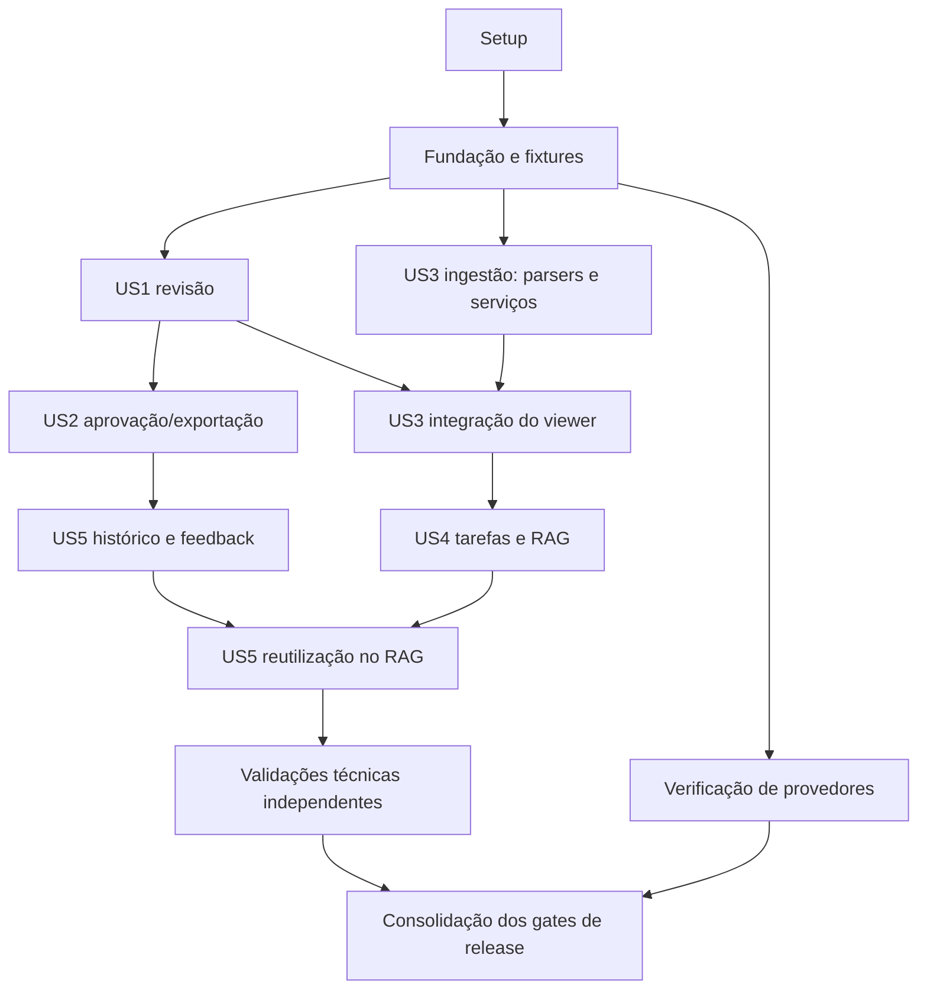

# Tasks: MVP de Revisão e Aprovação de RFPs/RFIs

**Input**: [spec.md](spec.md), [plan.md](plan.md), [data-model.md](data-model.md), [research.md](research.md), [contratos](contracts/application.md), [pipeline](contracts/pipeline.md) e [quickstart](quickstart.md).
**Branch**: `001-review-rfp-rfi` | **Data**: 2026-09-30
**Tests**: Obrigatórios por Constitution III/IV e pelos cenários da spec/plano solicitados pelo usuário. Escrever testes de comportamento antes dos serviços correspondentes e comprovar falha relevante, não apenas erro de importação; depois torná-los verdes.
**Organization**: jornadas em ordem de prioridade da spec: US1/US2 P1, US3/US4/US5 P2. Todos os requisitos F são P0 do MVP; a prioridade da jornada não a exclui da entrega.

## Formato e execução

Cada linha tem checkbox, ID, `[P]` opcional, `[USn]` nas jornadas e caminhos exatos. Caminhos são relativos ao repositório e podem apontar para arquivos ainda não criados. Seguir rigorosamente o design system: reutilizar componentes/tokens existentes; quando faltar componente, buscar no shadcn com o preset Base UI/base-nova do projeto, adaptar à identidade e registrar no catálogo; não introduzir estilos ou bibliotecas visuais inconsistentes. Antes de código Next.js ler o guia relevante em `node_modules/next/dist/docs/`. Não há código de implementação nesta lista.

`Depende` lista pré-requisitos diretos; dependências transitivas também valem. `[P]` indica tarefas de arquivos distintos que podem correr juntas **depois** dos pré-requisitos citados. Ao criar uma suite, integrá-la imediatamente à CI configurada no Setup; autorização externa bloqueia apenas os usos especificados, não a execução sintética. Não paralelizar migrations nem tarefas que alterem `package.json`/outros arquivos compartilhados. A apresentação por jornada não implica que se possa ignorar o grafo. Fases de dados compartilhados suportam testes por fixtures, sem exigir ingestão real antes de US1.

Os campos/restrições do modelo são reproduzidos literalmente nas tarefas de schema; aplicar também tipos/validações aos serviços e contratos correspondentes. Ausência de tamanho máximo de campo no modelo não autoriza inventar restrição comercial. Toda conclusão exige evidência observável e testes proporcionais.

## Phase 1: Setup — ambiente e ferramentas

**Objetivo**: Preparar a base existente, sem recriar Next.js ou substituir o design system.

**Teste independente/checkpoint**: Instalação reproduzível, scripts de teste disponíveis e execução local sem segredos reais.

- [X] T001 Conferir versões e guias locais de Next.js, arquitetura e tokens; registrar baseline e comandos existentes em `specs/001-review-rfp-rfi/validation/baseline.md`, preservando alterações anteriores do usuário.

- [X] T002 Adicionar e fixar dependências escolhidas no plano, incluindo Vitest/Playwright/axe, pg/Zod/Graphile, Supabase, editor e parsers, em `package.json` e `package-lock.json`; verificar compatibilidade Node 24/Next 16.3.6 e licenças; manter scripts existentes. Depende: T001.

- [X] T003 Criar validação de configuração e `.env.example` sem secrets em `src/server/config.ts`; separar URLs de app/worker/fila/migration, exigir segredos somente no servidor e modo fixture por padrão. Depende: T002.

- [X] T004 Configurar suites unit/integration/contract/E2E em `vitest.config.mts`, `playwright.config.ts` e `tests/helpers/database.ts`; adicionar scripts test:* do quickstart em `package.json`, banco descartável e rejeição de reset fora de localhost. Depende: T003.

- [X] T005 Criar `infra/Dockerfile.web`, `infra/Dockerfile.worker`, `infra/compose.yaml` e `supabase/config.toml` com imagem web e base de ferramentas do worker do mesmo projeto (consumer da fila em T021), PostgreSQL/pgvector, Auth/Storage locais, LibreOffice/fontes, Tesseract por+eng, canvas e ClamAV; fixar versões, separar rede de parsers e verificar healthchecks. Depende: T004.

- [ ] T006 Configurar `.github/workflows/ci.yml` desde o início com lint/typecheck/build e suites disponíveis, imagens fixadas e dados sintéticos; adicionar cada suite unit/integration/contract/E2E/evals-fixture à CI na tarefa que a cria, sem silenciar falhas ou declarar suite inexistente como aprovada. Execução provider é gate separado; checks obrigatórios bloqueiam merge/deploy e a configuração de proteção deve ser verificada antes da primeira integração. Depende: T005.

## Phase 2: Foundational — segurança, dados compartilhados e execução durável

**Objetivo**: Estabelecer invariantes comuns antes das jornadas; estas tarefas usam dados sintéticos.

**Teste independente/checkpoint**: Duas organizações isoladas, permissões atuais, fila idempotente e fixtures de domínio acessíveis apenas ao tenant correto.

- [ ] T007 [P] Escrever testes de contratos sessão/members/roles e de RLS em `tests/contract/identity.test.ts` e `tests/integration/tenant-isolation.test.ts`: 401/403/404, login de convidado, código inválido/expirado/reutilizado, logout, sessão expirada, contexto ausente, pool A→B, FKs cruzadas, role revogada e admin sem aprovação; obter falha comportamental antes da implementação. Depende: T006.

- [ ] T008 [P] Escrever testes de enqueue rollback, crash/reentrega, job tenant forjado e proibição de gravar decisão humana pelo worker em `tests/integration/jobs.test.ts`. Depende: T006.

- [ ] T009 Criar migrations de identidade em `supabase/migrations/202609300001_identity.sql`; aplicar a todas as entidades corporativas “organization_id NOT NULL” e “UNIQUE (organization_id,id)”, FKs compostas, UTC e RLS ENABLE/FORCE com roles runtime sem ownership/BYPASSRLS. Restrições literais do modelo: `organizations`: “id, name, timezone, created_at, pilot_ended_at nullable, active_content_delete_at, backup_expire_by; prazos derivados do encerramento conforme FR-SEC-06; cadastro operacional Tendra”. `memberships`: “organization_id, user_id (Auth subject), role nullable `reviewer/approver`, is_admin, active, version; unique org/user. Admin não implica papel de produto; um administrador ativo por org no MVP”. `invitations`: “org, intended_subject/email protegido, token_hash, expires_at, accepted_at, intended_capability, created_by; uso único e vínculo verificado; e-mail não determina tenant”. `admin_transfers`: “org, previous_user, next_user, operator_id, confirmation_reference, created_at; troca atômica; confirmação não contém documentos de cliente em logs”. Depende: T007.

- [ ] T010 Criar schema compartilhado de documentos/proveniência em `supabase/migrations/202609300002_documents.sql`, com índices por tenant e RLS/grants na mesma migration; não publicar objetos/chunks antes de confirmação necessária. Restrições literais do modelo: `documents`: “org, id, kind `knowledge/imported_history/questionnaire`, display_name, uploaded_by, current_version_id, status, support_reference nullable”. `document_versions`: “org, document_id, version, object_key, sha256, byte_size ≤50000000, verified_mime, source_updated_at nullable, updated_at_provenance, available, created_at; objetos imutáveis. Upload não é atualização da fonte”. `extractions`: “org, document_version_id, revision, extractor_version, rendition_key/hash nullable, units_json ou referências protegidas, ocr_required, status, confirmed_by/at, confirmed_hash; original preservado e OCR bruto separado de correções”. `chunks`: “org, extraction_id, index_version, ordinal, text protegido, token_count, locator JSON, source_hash; unique versão/ordinal. Só extração válida e OCR confirmado podem ficar search-ready”. `chunk_embeddings`: “org, chunk_id, model, dimensions, index_version, embedding; unique chunk/model/index_version. Nunca comparar vetores de espaços diferentes”. Depende: T009.

- [ ] T011 Criar schema compartilhado de tarefas/respostas em `supabase/migrations/202609300003_workflow.sql`, FKs tenant-scoped, ponteiros de versão e estados conforme data-model.md; separar imutabilidade do conteúdo da atualização dos ponteiros. Restrições literais do modelo: `rfp_tasks`: “org, name, recipient_company, kind RFP/RFI, due_date, owner_user_id, questionnaire_version_id, processing_status, content_epoch; responsável precisa membership ativa; rejeitar prazo passado na criação”. `items`: “org, task_id, ordinal, original_label, question_text, question_language pt/en, question_locator, current_revision_id nullable, original_suggestion_id nullable, state, lock_epoch; unique task/ordinal, label original pode repetir”. `suggestions`: “org, item_id, pipeline_version, model_snapshot, prompt_version, retrieval_manifest, output protegido, status, created_at; sugestão original nunca sobrescrita por edição humana”. `answer_revisions`: “org, item_id, revision, rich_text, plain_text protegido, origin `suggested/manual/mixed`, author_user_id nullable para geração, suggestion_id nullable, previous_id, created_at; imutável”. `evidence_links`: “org, answer_revision_id/suggestion_id, claim_id, chunk_id nullable, historical_approval_id nullable, source_version_id, locator, quoted_span/hash, verification_status; fonte externa ao conjunto recuperado é inválida; indisponibilidade não apaga metadados”. `gaps`: “org, item_id, answer_revision_id, description protegida, status pending/resolved, resolution_type, resolved_by/at; resolution_type inclui manual_unavailable, vinculado à declaração manual na resposta e ao alerta de ausência de fonte; pending bloqueia gate”. Depende: T010.

- [ ] T012 Criar schema de decisões, leases e exportações em `supabase/migrations/202609300004_decisions.sql`; evitar cascade de identidade que apague decisões e negar escrita de ações humanas à role worker. Restrições literais do modelo: `alerts`: “org, item_id, answer_revision_id, kind, source_ref nullable, critical_category nullable, condition_hash, active; tipos: low_confidence, conflict, old_source, unknown_age, critical, manual_no_source, old_answer”. `alert_actions`: “org, alert_id, revision_id, actor_id, action `acknowledge/select_source/manual/confirm_validation`, selected_source_id nullable, condition_hash, at; append-only, cada alerta individual, confirmação crítica só approver”. `review_decisions`: “org, item_id, revision_id, actor_id, kind `review/approve/invalidate`, previous_decision_id nullable, at; aprovação vigente projetada no item, invalidação não apaga histórico”. `edit_leases`: “org, item_id unique, holder_user_id, session_id, fencing_token monotônico, expires_at, last_activity_at; retomada exige novo token”. `exports`: “org, task_id, requested_by, format docx/xlsx, task_epoch, manifest JSON protegido, status, object_key nullable, sha256, created_at/completed_at, published_at nullable e imutável após publicação; manifesto lista revisões/aprovações/fontes imutáveis”. Depende: T011.

- [ ] T013 Criar schema de processamento/auditoria/métricas em `supabase/migrations/202609300005_operations.sql`; implementar scripts `db:migrate:local` em `scripts/migrate-local.ts` e registro no `package.json`. Restrições literais do modelo: `processing_runs`: “org, resource_kind/id/version, stage, pipeline_version, status, attempt, progress_done/total nullable, safe_error_code, retryable, timestamps; unique logical_job_key”. `audit_events`: “org, actor_kind/id, action, resource_kind/id, revision_id nullable, result, correlation_id, at; append-only, sem corpo corporativo”. `metric_events`: “org, event_type, technical_ids, numeric_measures, formula_version, at; allowlist sem textos livres”. Depende: T012.

- [ ] T014 Implementar `src/server/db/tenant-transaction.ts` e `src/server/db/roles.ts` com contexto local por transação, vínculos atuais e consultas parametrizadas; autorização/locks/decisão/auditoria atômicos, ordem tarefa→itens; passar testes RLS com role real. Depende: T013.

- [ ] T015 Implementar sessão Supabase SSR e DAL em `src/server/auth/session.ts`, `src/modules/identity/permissions.ts` e `src/app/auth/callback/route.ts`; verificar token no servidor, membership atual e convites, não derivar tenant do e-mail nem confiar em getSession sozinho. Depende: T014.

- [ ] T016 Implementar validação Zod, erros sanitizados, Origin/CSRF, idempotência por org/ator/operação/hash e paginação 25/máximo100 em `src/server/http/contracts.ts`, `src/server/http/idempotency.ts` e `supabase/migrations/202609300006_idempotency.sql`; private/no-store, nenhuma mutação por GET e nenhuma autoridade no payload. Depende: T015.

- [ ] T017 Implementar auditoria transacional e telemetria allowlist em `src/modules/measurements/audit.ts` e `src/modules/measurements/events.ts`; bloquear corpos/prompts/justificativas/secrets/URLs assinadas inclusive em logs de SDK, com sentinelas em `tests/unit/telemetry.test.ts`. Depende: T016.

- [ ] T018 Implementar GET session/members e PATCH role em `src/app/api/v1/organizations/[org]/session/route.ts`, `src/app/api/v1/organizations/[org]/members/route.ts` e `src/app/api/v1/organizations/[org]/members/[user]/role/route.ts`; criar login por e-mail/OTP em `src/app/auth/page.tsx`, saída autenticada por POST em `src/app/auth/logout/route.ts` com proteção Origin/CSRF e limpeza de sessão, recuperação de sessão expirada sem expor conteúdo e gestão de papéis em `src/app/(workspace)/members/page.tsx`; passar contratos de identidade. Depende: T015, T017.

- [ ] T019 Implementar `scripts/provision-organization.ts` e `scripts/transfer-admin.ts` com operador autenticado, confirmação referenciada, convite de uso único e troca atômica preservando papéis; testar falha parcial/usuário não convidado em `tests/integration/admin-operations.test.ts`, sem enviar e-mails reais nos testes. Depende: T018.

- [ ] T020 Implementar adapter privado em `src/server/storage/objects.ts`, bucket de quarentena e políticas em `supabase/migrations/202609300007_storage.sql`; resolver chave pelo domínio autorizado, isolar chave privilegiada, suportar upload direto e Range sem expor credenciais. Depende: T019.

- [ ] T021 Implementar enqueue transacional e worker em `src/server/jobs/queue.ts`, `src/worker/main.ts` e `src/server/jobs/runner.ts`; registrar `worker:dev` em `package.json`; payload apenas IDs, envelope confiável, conexão de domínio restrita, 3 retries transitórios com jitter, idempotência por versão, falha distinta de ausência de contexto; passar testes de jobs. Depende: T020, T008.

- [ ] T022 Implementar registro operacional de países/provedores autorizados por org, responsável e instante em `supabase/migrations/202609300008_destinations.sql`, `scripts/record-destination-authorization.ts` e `src/modules/identity/destination-policy.ts`; integrar bloqueio antes de upload/storage/IA real e nova autorização após mudança; testar FR-SEC-05 em `tests/integration/destinations.test.ts`. Depende: T021.

- [ ] T023 Implementar contratos/testes e serviços compartilhados GET status e POST retry em `tests/contract/processing-runs.test.ts`, `src/modules/documents/processing-runs.ts`, `src/app/api/v1/processing-runs/[id]/route.ts` e `src/app/api/v1/processing-runs/[id]/retry/route.ts` antes das jornadas: testar primeiro com handlers fixture, depois validar tenant/papel/versão, progresso, awaiting_confirmation, erro sanitizado e enqueue idempotente. Os handlers de cada etapa serão registrados pelas jornadas; etapa não registrada falha explicitamente. Depende: T021, T022.

- [ ] T024 Criar seed idempotente sintético em `scripts/seed-pilot.ts` e `tests/fixtures/pilot.ts`, com A/B, três capacidades, docs/extrações prontas e pendentes, perguntas, sugestões, revisões, alertas, aprovações e 100 itens; registrar `seed:pilot` em `package.json`; não fabricar aprovação de histórico importado; passar fundação completa. Depende: T023.

## Phase 3: US1 — Revisar respostas e conferir evidências (P1)

**Objetivo**: Entregar revisão por item com fontes, editor e tratamento individual de riscos.

**Teste independente/checkpoint**: Com fixtures prontas: navegar, abrir fonte exata e voltar ao foco; editar sem perda; sessão concorrente não sobrescreve; lacuna manual é rastreável.

- [ ] T025 [P] [US1] Escrever contratos GET lista de itens/item/evidence/content, lease/renew/release, answer, restore-original, alerts/actions e gaps/resolve em `tests/contract/review.test.ts`; cobrir versão antiga, tenant, fonte indisponível, manual_unavailable e confirmação crítica indevida. Depende: T024.

- [ ] T026 [P] [US1] Escrever testes com relógio/barreiras em `tests/integration/edit-leases.test.ts`: TTL 120 s, heartbeat 30 s, inatividade 5 min, exclusividade por item, fencing, save falho, edição de aprovado invalida decisão e inclusão manual de multa/garantia exige nova avaliação antes de aprovar. Depende: T024.

- [ ] T027 [P] [US1] Escrever E2E da revisão em `tests/e2e/review.spec.ts` para split view, teclado, fonte/retorno, autosave, original, conflito de sessão e alertas simultâneos, usando fixtures independentes da ingestão. Depende: T024.

- [ ] T028 [US1] Criar tipos/validadores de conteúdo rico e versões em `src/modules/review/model.ts`; admitir apenas texto/negrito/itálico/listas, estados “Sem rascunho”, “Sugerida”, “Em revisão”, “Revisada”, “Aprovada” e origin “suggested/manual/mixed”, rejeitando HTML arbitrário e claims de aprovação do client. Depende: T025, T026, T027.

- [ ] T029 [US1] Implementar avaliação versionada de risco em `src/modules/review/risk-assessment.ts` e `tests/integration/manual-risk-assessment.test.ts`, criando registros de avaliação separados da revisão imutável, com status pending/completed/failed e answer_revision_id/risk_policy_version, em `supabase/migrations/202609300009_risk_assessments.sql`, com RLS, FK tenant-scoped e unique por revisão/política: save manual, edição e restauração marcam pending atomicamente; avaliar pergunta+resposta atual para os seis assuntos críticos, somente resultado da mesma revisão pode concluir, falha bloqueia aprovação e exportação. Introduzir porta para detector real e adapter fixture determinístico em `tests/fixtures/risk-detector.ts`; fixture só opera em ambiente sintético, produção exige o detector avaliado da US4. Depende: T028.

- [ ] T030 [US1] Implementar acquire/renew/release e checks de fencing em `src/modules/review/leases.ts`; encerrar exige versão salva, token expirado não revive e usuário antigo recebe conflito com buffer preservado. Depende: T029.

- [ ] T031 [US1] Implementar autosave CAS, revisão imutável, restauração original, revalidação das evidências/alertas afetados e invalidação atômica da aprovação e da avaliação de risco, agendando avaliação da nova revisão em `src/modules/review/answers.ts`; sem mudança canônica não duplica versão. Depende: T030.

- [ ] T032 [US1] Implementar idade >120dias e data desconhecida, conflitos, baixo suporte, seis categorias críticas e ações individuais em `src/modules/review/alerts.ts`; integrar avaliação T029 para detectar novos riscos também em texto manual/editado; confirmação crítica só Aprovador por versão; nunca reconhecer todos. Depende: T031.

- [ ] T033 [US1] Implementar resolução de lacunas em `src/modules/review/gaps.ts`, incluindo “manual_unavailable” com declaração escrita por pessoa na revisão atual, autoria e alerta manual_no_source; reconhecer baixa confiança não resolve lacuna nem aprova; preservar declaração na entrega. Depende: T032.

- [ ] T034 [US1] Implementar resolução de fonte/localizador e streaming autorizado em `src/modules/knowledge/evidence.ts`, `src/app/api/v1/evidence/[id]/route.ts` e `src/app/api/v1/documents/[id]/content/route.ts`; hash/versão, PDF página/caixa, XLSX aba/célula, Office preview convertido, metadados preservados se indisponível. Depende: T033.

- [ ] T035 [US1] Implementar consulta tenant-scoped/ordenada/paginada em `src/modules/proposals/item-list.ts` e handler `src/app/api/v1/tasks/[id]/items/route.ts` para navegação US1; implementar handlers de `src/app/api/v1/items/[id]/route.ts`, `src/app/api/v1/items/[id]/lease/route.ts`, `src/app/api/v1/items/[id]/lease/renew/route.ts`, `src/app/api/v1/items/[id]/answer/route.ts`, `src/app/api/v1/items/[id]/restore-original/route.ts`, `src/app/api/v1/alerts/[id]/actions/route.ts` e `src/app/api/v1/gaps/[id]/resolve/route.ts` usando serviços/DTOs e verificações de cada comando. Depende: T034.

- [ ] T036 [P] [US1] Implementar `src/components/features/evidence-viewer.tsx` com PDF.js, grade de células, indicação de prévia convertida, idade/indisponibilidade, foco restaurado e fonte original autorizada. Depende: T035.

- [ ] T037 [P] [US1] Implementar `src/components/features/answer-editor.tsx` com Tiptap restrito, autosave/flush/status, edição aprovada avisada, original/restauração, lease e buffer em memória preservado em falha sem localStorage/telemetria de texto. Depende: T035.

- [ ] T038 [US1] Integrar editor/fontes/alertas/lacunas em `src/app/(workspace)/tasks/[id]/review/page.tsx` e `src/components/features/review-workspace.tsx`; ≥1280 split, 768–1279 sequencial, <768 consulta, próximo/anterior e deep-link de item; passar testes US1 e registrar evidência em `specs/001-review-rfp-rfi/validation/us1.md`. Depende: T036, T037.

## Phase 4: US2 — Aprovar e exportar com controle humano (P1)

**Objetivo**: Aplicar aprovação versionada e exportação integral autorizada.

**Teste independente/checkpoint**: Com tarefa fixture: Revisor é recusado; Aprovador aprova sem revisão prévia quando permitido; edição invalida; DOCX/XLSX reproduzem apenas manifesto aprovado.

- [ ] T039 [P] [US2] Escrever contratos review/approve/task exports/export status/download em `tests/contract/approval-export.test.ts`: texto vazio, lease, papel revogado, crítica sem confirmação, pendências e zero itens. Depende: T038.

- [ ] T040 [P] [US2] Escrever corridas editar/aprovar/exportar e testes de paridade DOCX/XLSX em `tests/integration/export-snapshot.test.ts`, incluindo mudança de epoch/alerta/papel antes de publicar/baixar e strings XLSX nunca fórmulas; testar que entrega publicada antes do encerramento pode ser recuperada como histórica até 30 dias, mesmo após edição, enquanto nova exportação exige gates atuais; negar job nunca publicado, usuário sem papel e prazo vencido. Depende: T038.

- [ ] T041 [US2] Implementar serviço review/approve em `src/modules/review/decisions.ts` e handlers `src/app/api/v1/items/[id]/review/route.ts` e `src/app/api/v1/items/[id]/approve/route.ts`; locks tarefa→item, papel atual, revisão salva não vazia, sem lease, avaliação de risco completed da mesma revisão/política vigente, gaps/alertas tratados e confirmação crítica; evento append-only na mesma transação. Depende: T039, T040.

- [ ] T042 [US2] Implementar quality gate e manifesto em `src/modules/exports/snapshot.ts`; exigir total>0/processamento pronto/100% versões atuais aprovadas/zero bloqueios e avaliação de risco concluída da versão atual, capturar task_epoch e referências imutáveis, enqueue transacional e erro com contagens/IDs pendentes. Depende: T041.

- [ ] T043 [P] [US2] Implementar renderer em `src/modules/exports/render-docx.ts`, incluindo perguntas/IDs/texto final, evidências e trechos manuais sem fonte ou declaração de indisponibilidade; nunca usar sugestão antiga ou URL assinada. Depende: T042.

- [ ] T044 [P] [US2] Implementar renderer em `src/modules/exports/render-xlsx.ts`, mesmo manifesto/ordem/conteúdo, valores strings, referências por página/célula e identificação manual, sem fórmulas de entrada. Depende: T042.

- [ ] T045 [US2] Implementar `src/server/jobs/render-export.ts` e `src/modules/exports/delivery.ts` com falha/retry idempotente, revalidação de epoch/gate/papel na publicação/download, estado stale e nenhum envio automático; implementar recuperação histórica separada conforme `specs/001-review-rfp-rfi/contracts/lifecycle.md`, sem regenerar arquivos ou remover a indicação de histórico. Depende: T043, T044.

- [ ] T046 [US2] Implementar `src/app/api/v1/tasks/[id]/exports/route.ts`, `src/app/api/v1/exports/[id]/route.ts` e `src/app/api/v1/exports/[id]/download/route.ts`, adicionar `src/app/api/v1/exports/[id]/recover/route.ts` para recuperação histórica pós-encerramento, ambos com stream autenticado e regras distintas explícitas; passar contratos e corridas. Depende: T045.

- [ ] T047 [US2] Integrar ações individuais e painel de exportação em `src/components/features/approval-actions.tsx`, `src/components/features/export-panel.tsx` e `src/components/features/review-workspace.tsx`; motivos e links para pendências, avanço após aprovação, sem lote. Depende: T046.

- [ ] T048 [US2] Executar fluxo de aprovação/exportação em `tests/e2e/approval-export.spec.ts`, abrir arquivos gerados e comparar com manifesto, validar recuperação histórica e bloqueios de nova exportação, registrar resultados em `specs/001-review-rfp-rfi/validation/us2.md`. Depende: T047.

## Phase 5: US3 — Construir conhecimento corporativo (P2)

**Objetivo**: Adicionar documentos e histórico importado com OCR conferido e base rastreável.

**Teste independente/checkpoint**: Org vazia pode adiar onboarding; formatos válidos processam, inválidos falham isoladamente; OCR pendente não indexa; histórico importado não ganha aprovação.

- [ ] T049 [P] [US3] Escrever contratos upload/complete/documents/extraction/edit/confirm em `tests/contract/documents.test.ts`: 50.000.000 bytes aceitos, 50.000.001 rejeitados, identidade de objeto, OCR com hash obsoleto e destinos não autorizados. Depende: T024.

- [ ] T050 [P] [US3] Criar fixtures PDF textual/misto/digitalizado, DOCX/PPTX com tabelas e XLSX com abas/mescladas/fórmula sem cache em `tests/fixtures/documents/manifest.json` e `tests/integration/document-processing.test.ts`; incluir corrupção, expansão ZIP, traversal e origem privada, sem dados reais. Depende: T024.

- [ ] T051 [US3] Implementar validação e tipos em `src/modules/documents/model.ts` seguindo schema compartilhado, status de suporte sem confundir sucesso, metadados de atualização confiável separados de upload, idioma pt/en e original imutável. Depende: T049, T050.

- [ ] T052 [US3] Implementar intenção/conclusão/validação em `src/modules/documents/uploads.ts`, `src/app/api/v1/organizations/[org]/uploads/route.ts` e `src/app/api/v1/uploads/[id]/complete/route.ts`; validar tamanho real/hash/MIME/purpose, chave autorizada, scanner/quarentena e enqueue; arquivo inválido não interrompe demais. Depende: T051.

- [ ] T053 [US3] Implementar execução de subprocessos sem rede e temporários isolados em `src/server/documents/sandbox.ts`; limites CPU/memória/tempo/expansão, macro/link proibidos, ClamAV indisponível mantém quarentena, cleanup após crash e falhas sanitizadas. Depende: T052.

- [ ] T054 [P] [US3] Implementar extração/rasterização PDF.js e OCR Tesseract em `src/server/documents/pdf.ts` e `src/server/documents/ocr.ts`; localizador original página1-based/caixa/span/hash, texto bruto separado de correção; misto exige conferência de toda a parte OCR. Depende: T053.

- [ ] T055 [P] [US3] Implementar conversão DOCX/PPTX com LibreOffice em `src/server/documents/office.ts`, perfil isolado/fontes fixadas, preview imutável e aviso de conversão; conteúdo perdido/ilegível não pode parecer extração completa. Depende: T053.

- [ ] T056 [P] [US3] Implementar leitura XLSX em `src/server/documents/spreadsheet.ts`, localizador aba/intervalo A1/cabeçalhos, não executar fórmulas e explicitar valores ausentes/conteúdo não extraível. Depende: T053.

- [ ] T057 [US3] Implementar `src/server/jobs/extract-document.ts` e `src/modules/documents/extractions.ts` com CAS, OCR awaiting_confirmation sem slot ativo, confirmação humana revision/hash e bloqueio de indexação/perguntas até confirmação; retry não duplica extração. Depende: T054, T055, T056.

- [ ] T058 [US3] Implementar chunks/unidades e indexação em `src/modules/knowledge/indexing.ts` e `src/server/jobs/index-document.ts`: alvo 600 / sobreposição 80, hash/localizador, staging e publicação atômica, embeddings por modelo/dimensão, histórico importado identificado; adapter fixture de embeddings em `src/server/ai/embeddings.ts` substituível pelo real US4. Depende: T057.

- [ ] T059 [US3] Implementar GET documents/extraction, PATCH extraction e POST confirm em `src/app/api/v1/documents/route.ts`, `src/app/api/v1/documents/[id]/extraction/route.ts` e `src/app/api/v1/documents/[id]/extraction/confirm/route.ts`; autorização atual, DTO mínimo e validação do conteúdo corrigido. Depende: T058.

- [ ] T060 [US3] Implementar `src/app/(workspace)/knowledge/page.tsx`, `src/components/features/document-upload.tsx` e `src/components/features/ocr-review.tsx`: onboarding/Fazer depois, upload múltiplo/status/retry, idade/responsável/sem data, original+texto e confirmação explícita; usar status/retry da fundação T023 e integrar viewer US1. Depende: T059, T038.

- [ ] T061 [US3] Executar `tests/e2e/knowledge.spec.ts` cobrindo todos os formatos, dois idiomas, OCR/correção, falha parcial e isolamento de preview/download; registrar verificação de localizadores e limites em `specs/001-review-rfp-rfi/validation/us3.md`. Depende: T060.

## Phase 6: US4 — Criar e acompanhar uma RFP/RFI (P2)

**Objetivo**: Importar perguntas e gerar sugestões em background com progresso e erros confiáveis.

**Teste independente/checkpoint**: Criar tarefa, sair e retornar: contagens corretas; ausência/partial/conflict explícitos; job interrompido não duplica nem sobrescreve edição humana.

- [ ] T062 [P] [US4] Escrever contratos de criação/listagem de tasks e integração com consultas de itens/status/retry já existentes em `tests/contract/tasks.test.ts`: prazo passado, responsável cruzado, base vazia permitida, zero itens, importação parcial e cursor tenant-scoped. Depende: T061.

- [ ] T063 [P] [US4] Preparar conjuntos separados de calibração e aceitação de 100 perguntas rotuladas em `tests/evals/calibration.json` e `tests/evals/acceptance-100.json`; pt/en, seis assuntos críticos, ausência, lacuna, conflito e prompt injection; registrar revisão humana esperada, sem inventar que já ocorreu. Preparar também conjunto complementar rotulado para o detector real com respostas manuais, edições e restaurações que introduzam cada uma das seis categorias críticas, incluindo paráfrases pt/en e casos sem risco, em `tests/evals/manual-risk.json`; esse conjunto não substitui nem altera o denominador das 100 perguntas de SC-013. Depende: T061.

- [ ] T064 [US4] Implementar `src/modules/proposals/model.ts` e `src/modules/proposals/tasks.ts` com criação/totais/estado, data YYYY-MM-DD na timezone da org, nome inicial do arquivo, proprietário ativo e aviso de base vazia; invariantes da migration compartilhada. Depende: T062, T063.

- [ ] T065 [US4] Implementar `src/server/jobs/extract-questions.ts` com extração segmentada das unidades aprovadas, staging de itens, ordinal único e label original repetível; zero itens/falha parcial explícitos, retry não duplica e versão obsoleta não publica. Depende: T064.

- [ ] T066 [US4] Implementar busca híbrida tenant-scoped em `src/modules/knowledge/retrieval.ts`; texto+pgvector exato, RRF, até 20 candidatos / 8 trechos / 6.000 tokens, só versão pronta, manifesto imutável e exclusão de OCR não confirmado; testar recall e acesso cruzado em `tests/integration/retrieval.test.ts`. Depende: T065.

- [ ] T067 [US4] Implementar SDK/provider em `src/server/ai/generation.ts` e completar `src/server/ai/embeddings.ts`; baseline/configuração do plano, store:false sem prometer retenção zero, autorização de destino antes do envio, sem ferramentas, dados mínimos, timeout/429/recusa/truncamento explícitos e modo fixture. Depende: T066.

- [ ] T068 [US4] Implementar schema e validação de claims/fontes/locators/idioma em `src/modules/knowledge/grounding.ts` e `src/modules/knowledge/risk-detection.ts`; fontes devem estar no manifesto, cobertura parcial gera gaps, regras/classificador detectam seis categorias; falha de avaliador é failed, não no_context; conectar o detector real à porta de avaliação versionada T029 para conteúdo gerado, manual, editado e restaurado; calibrar apenas no conjunto de calibração. Depende: T067.

- [ ] T069 [US4] Implementar `src/server/jobs/generate-item.ts`: sem suporte→sem rascunho, parcial→somente parte sustentada, conflito→fontes/decisão humana, riscos→alertas; persistir modelo/prompt/pipeline/versionamento, sem sobrescrever edição/aprovação; associar evidências por claim e origem; resultado de risco usa a mesma revisão/política, nunca conclui avaliação de revisão posterior. Depende: T068.

- [ ] T070 [US4] Implementar criação/listagem em `src/app/api/v1/tasks/route.ts` e integrar serviços existentes de `src/modules/proposals/item-list.ts` e `src/modules/documents/processing-runs.ts`; registrar handlers de importação/geração, totais/progresso, sem reimplementar rotas prontas, com erros legíveis e caminho de suporte. Depende: T069.

- [ ] T071 [US4] Implementar `src/app/(workspace)/tasks/page.tsx`, `src/components/features/create-task.tsx` e `src/components/features/task-progress.tsx`; formulário/painel/listagem, retorno durante jobs, polling 2 s / 10 s background, contagens/links ao workspace e indicação de falhas/zero itens. Depende: T070.

- [ ] T072 [US4] Criar `scripts/eval-rag.ts` e scripts `eval:rag:fixtures`/`eval:rag:provider` em `package.json`; relatório sem conteúdo, versão/configuração, ≥95/100 e zero fatos sem suporte/fontes inventadas/críticos omitidos; não aceitar avaliação apenas do próprio LLM como revisão humana. Depende: T071.

- [ ] T073 [US4] Passar `tests/e2e/tasks.spec.ts` e `tests/integration/generation-recovery.test.ts` com provider fixture, crash após gravação/antes de ack, reprocessamento e interrupção de rede; registrar resultados em `specs/001-review-rfp-rfi/validation/us4.md`; teste real fica no gate final de SC-013. Depende: T072.

## Phase 7: US5 — Consultar histórico e avaliar sugestões (P2)

**Objetivo**: Expor conhecimento aprovado e medir utilidade sem vazar conteúdo.

**Teste independente/checkpoint**: Fixture aprovada mostra autor/data/fontes; histórico importado não aparece como aprovado; feedback positivo/negativo não envia justificativa à telemetria.

- [ ] T074 [P] [US5] Escrever contratos history e feedback em `tests/contract/history-feedback.test.ts`, cobrindo fonte indisponível, histórico importado excluído, tenant e justificativa privada. Depende: T048.

- [ ] T075 [US5] Criar `supabase/migrations/202609300010_feedback.sql` e `src/modules/measurements/feedback-model.ts`, com RLS e FK tenant-scoped. Restrições literais do modelo: `feedback`: “org, suggestion_id, actor_id, polarity positive/negative, justification protegida nullable, created_at; métricas recebem apenas polaridade/IDs”. Depende: T074.

- [ ] T076 [US5] Implementar histórico como consulta de decisões/revisões em `src/modules/review/history.ts` e `src/app/api/v1/history/route.ts`; não duplicar conteúdo, preservar versão/data/aprovador e reconhecer idade da resposta separada da idade da fonte. Depende: T075.

- [ ] T077 [US5] Implementar serviço e POST feedback em `src/modules/measurements/feedback.ts` e `src/app/api/v1/suggestions/[id]/feedback/route.ts`; polaridade/IDs em telemetria e justificativa apenas domínio protegido, idempotência de retry. Depende: T076.

- [ ] T078 [US5] Implementar `src/app/(workspace)/history/page.tsx` e `src/components/features/response-feedback.tsx`, fontes e aviso de indisponibilidade, campos de histórico e avaliação positiva/negativa com justificativa opcional. Depende: T077.

- [ ] T079 [US5] Integrar respostas aprovadas ao retrieval em `src/modules/knowledge/approved-history.ts` e `src/modules/knowledge/retrieval.ts`; manifesto referencia approvalId/version, >120dias gera old_answer, reutilizar nunca atualiza origem nem aprova novo item. Depende: T078, T073.

- [ ] T080 [US5] Passar `tests/e2e/history-feedback.spec.ts` e `tests/integration/history-reuse.test.ts` com fronteira 120/121 dias, nova aprovação obrigatória e privacidade de feedback; registrar em `specs/001-review-rfp-rfi/validation/us5.md`. Depende: T079.

## Phase 8: Polish & cross-cutting — métricas, ciclo de dados e liberação

**Objetivo**: Fechar integrações, evidências e controles de piloto real, sem inventar metas/autorizações.

**Teste independente/checkpoint**: Quickstart completo com fontes rastreáveis, isolamento, exclusão30/90 dias, relatórios de qualidade e gates documentados por responsável.

- [ ] T081 Implementar SC-004–009 em `src/modules/measurements/product-metrics.ts` e `tests/unit/product-metrics.test.ts`: proporções/versionamento de fórmulas, fontes mantidas, feedback/cobertura, tempos/baselines e no_data; TTFV sem alvo, aba aberta não é hora de especialista; manter propostas identificadas. Depende: T080.

- [ ] T082 Integrar o contrato confirmado `specs/001-review-rfp-rfi/contracts/lifecycle.md` aos cenários de `tests/contract/lifecycle.test.ts`: encerramento operacional autenticado e registrado, recuperação apenas de arquivos publicados antes do encerramento, versão histórica explícita, Aprovador atual, prazo de recuperação de 30 dias, exclusão ativa ao completar 30 dias e expiração dos backups até 90 dias; criar testes antes dos serviços de encerramento/expurgo, sem reabrir a distinção de exportação já aprovada. Depende: T048, T024.

- [ ] T083 Implementar o contrato confirmado em `src/modules/documents/pilot-lifecycle.ts`, `scripts/end-pilot.ts`, `src/server/jobs/purge-tenant-content.ts` e `supabase/migrations/202609300011_lifecycle.sql`; scheduler/expurgo idempotente cobrem originais/previews/extrações/chunks/embeddings/respostas/evidências/exports e jobs/caches derivados, sem registrar conteúdo; falha não vira exclusão concluída. Depende: T082, T080.

- [ ] T084 Testar encerramento/recuperação/expurgo/restore com relógio controlado em `tests/integration/pilot-retention.test.ts` e `tests/e2e/pilot-recovery.spec.ts`; 30/90 dias partem do mesmo instante, fontes/histórico não retêm texto vencido, usuário sem permissão não recupera entregas. Depende: T083.

- [ ] T085 Preparar inventário verificável de países/provedores/cópias/retenção/uso para treinamento em `specs/001-review-rfp-rfi/validation/provider-readiness.md`; confrontar configurações/contratos reais com FR-SEC-05/06, obter autorização por participante e decisão sobre treinamento/metadados antes de dados reais; resultado deve indicar evidência ou bloqueio específico, nunca presumir aprovação. Depende: T022.

- [ ] T086 Após decisão registrada sobre prazo de metadados em provider-readiness.md, implementar política minimizada em `src/modules/measurements/retention.ts` e `tests/integration/metadata-retention.test.ts`; preservar rastreabilidade pelo prazo autorizado sem inventar retenção ilimitada ou guardar texto corporativo. Depende: T085, T017.

- [ ] T087 Executar e corrigir testes axe/teclado/leitor de tela em `tests/e2e/accessibility.spec.ts`, `src/components/features/review-workspace.tsx` e `src/app/design-system/page.tsx`; cobrir editor/fontes/OCR/alertas/aprovação, responsividade/foco/estados anunciados e registrar limites da auditoria em `specs/001-review-rfp-rfi/validation/accessibility.md`. Depende: T080.

- [ ] T088 Medir troca de itens/filas/extração/RAG e recursos usando `scripts/benchmark-pilot.ts` e `specs/001-review-rfp-rfi/validation/performance.md`; fixture 100 e p95≤1s continuam proposta SC-012; apresentar orçamento, volumes e SLO propostos ao responsável sem vendê-los como compromisso aprovado. Depende: T038, T073.

- [ ] T089 Implementar e ensaiar backup/restore conjunto de banco+objetos em `scripts/restore-pilot.ts` e `docs/operations/pilot-recovery.md`; comprovar hashes, permissões, jobs e exclusão vencida, registrar tempos/perda observados e apresentar proposta de RPO/RTO com evidência para decisão em `specs/001-review-rfp-rfi/validation/operations.md` antes de compromisso operacional. Depende: T084.

- [ ] T090 Executar avaliação real SC-013 sobre as 100 perguntas revisadas por pessoas em `scripts/eval-rag.ts`, registrar configuração e relatório protegido/referenciado em `specs/001-review-rfp-rfi/validation/ai-acceptance.md`; exigir ≥95 corretas e zero nos 3 critérios críticos; corrigir/reavaliar sem treinar na amostra de aceitação. Pode avaliar o provedor com corpus sintético autorizado sem aguardar decisões operacionais; uso de dados corporativos reais exige adicionalmente T085 favorável. Registrar esse gate condicional, não bloquear avaliação sintética por autorização de dados reais. Executar também `tests/evals/manual-risk.json` com o detector real integrado: nenhum assunto crítico rotulado pode ser omitido; testar pending/failed bloqueando aprovação, confirmação por versão e resultado atrasado incapaz de liberar outra revisão em `tests/integration/manual-risk-assessment.test.ts`. Registrar os resultados separadamente das 100 perguntas de SC-013; falhas desse controle bloqueiam liberação. Depende: T072, T080.

- [ ] T091 Preparar e executar com participantes autorizados roteiro Q-13 em `specs/001-review-rfp-rfi/validation/user-study.md`: fonte/deep-link, reconhecimento de alertas e papéis; registrar observações sem conteúdo/confidenciais, corrigir problemas encontrados antes de escala; não marcar concluído sem participação real. Depende: T038, T048, T061.

- [ ] T092 Executar matriz adversarial completa em `tests/integration/security-regression.test.ts`: IDs/jobs/URLs/vetores entre tenants, cache/pool, prompt injection, mudanças de papel, scanner offline, corridas save/approve/export e sentinelas de logs; falhas bloqueiam release. Depende: T080, T084.

- [ ] T093 Executar todos os comandos do `specs/001-review-rfp-rfi/quickstart.md`, atualizar comandos realmente disponíveis, `docs/architecture.md` e `docs/design-system/README.md`; registrar Constitution Check e cobertura F/FR/SC em `specs/001-review-rfp-rfi/validation/release.md`, incluindo aceite das fórmulas/metas propostas P-02 ou rótulo de não validadas; não declarar piloto liberado com gates reais pendentes. Depende: T081, T084, T086, T087, T088, T089, T090, T091, T092, T006.

## Dependencies & Execution Order

US1 é testável com fixtures após a fundação, incluindo sua própria listagem de itens e avaliação versionada de riscos. Status/retry de processamento já existem na fundação, evitando dependência circular da ingestão com US4. US2 precisa dos serviços de edição/alertas da US1, mas não da ingestão. US3 pode desenvolver parsers/serviços após a fundação, integrando viewer da US1 ao final. US4 depende da publicação de documentos/extrações US3. US5 pode iniciar sobre aprovações fixture após US2; apenas integração de reutilização depende de US4. Migrations compartilhadas são sequenciais e não têm dependências circulares.

## Parallel examples por jornada

- **US1**: T025, T026, T027 em arquivos distintos, após seus pré-requisitos; implementar somente depois de estabelecer os contratos/fixtures necessários.

- **US2**: T039, T040 em arquivos distintos, após seus pré-requisitos; implementar somente depois de estabelecer os contratos/fixtures necessários.

- **US3**: T054, T055, T056 em arquivos distintos, após seus pré-requisitos; implementar somente depois de estabelecer os contratos/fixtures necessários.

- **US4**: T062, T063 em arquivos distintos, após seus pré-requisitos; implementar somente depois de estabelecer os contratos/fixtures necessários.

- **US5**: T074 pode iniciar após US2 e em paralelo aos testes/serviços de US3; integração T079 aguarda US4. As tarefas internas compartilham dependências e permanecem sequenciais.

## Pendências convertidas em trabalho concreto

| Ponto | Trabalho e responsável | Bloqueio específico |
| --- | --- | --- |
| P-01 resolvido como critério | Engenharia prepara/calibra em T063, T068, T072; avaliadores humanos + engenharia executam T090 | Liberação de IA real até SC-013 passar; não impede modo fixture |
| P-02 métricas propostas | Engenharia instrumenta T081/T088; responsável de produto decide fórmulas/alvos no relatório T093 | Declarar meta atingida; não impede medir TTFV sem target |
| P-03 dados/provedores | Engenharia implementa FR-SEC-05/06 em T022, T083 e T084; responsável da empresa autoriza destinos, responsável de produto decide uso/retenção de metadados em T085 | Dados reais e política de metadados; não impede desenvolvimento sintético |
| Encerramento/recuperação confirmado | Engenharia implementa contrato e testes T082–T084; recuperação histórica em T045/T046 | Arquivo publicado antes do encerramento, Aprovador vigente e prazo de 30 dias; sem nova aprovação implícita |
| P-04 operação | Engenharia mede T088/T089; responsável do piloto decide orçamento/volume/RPO/RTO | Compromisso operacional; não impede testes locais |
| P-05 usuários reais | Produto conduz T091 com roteiro preparado | Escala, sem fingir validação humana com testes automáticos |
| P-06 resolvido | Engenharia implementa T033 e comprova exportação T048 | Sem pergunta adicional: declaração manual permitida com alertas/aprovação |

Se uma decisão externa estiver pendente, registrar responsável, pergunta concreta, proposta e evidência existente; manter apenas a tarefa dependente aberta e executar as independentes. Não marcar tarefa de validação humana concluída com uma proposta. Não contratar serviços, enviar convites reais, realizar deploy ou apagar dados reais como consequência automática de criar esta lista.

## Rastreabilidade de requisitos

| Requisitos | Tarefas principais |
| --- | --- |
| F-01–04, FR-INPUT-01 | T049–T061 |
| F-09–12 | T023, T035, T062–T073 |
| F-18–21 | T025–T038, T029 |
| F-22, F-26 | T039–T048 |
| F-23, F-27 | T074–T080 |
| FR-ROLE-01, FR-SEC-01–04 | T007–T024, T092 |
| FR-SEC-05 | T022, T085 |
| FR-SEC-06 | T082–T086, T089 |
| SC-001–003 | Checkpoints US1–US5, T092, T093 |
| SC-004–009 | T081, T093 |
| SC-010–012 | T017, T087, T088, T092 |
| SC-013 | T063, T068, T072, T090 |

## Implementation Strategy

Primeiro incremento demonstrável: Setup + Fundação + US1, com dados sintéticos preparados. Em seguida US2 completa o núcleo revisão/aprovação/exportação. Isso é uma fatia de validação, **não o MVP completo**: todas as cinco jornadas e controles transversais fazem parte do escopo confirmado.

Entregar verticalmente, executar cada checkpoint antes de considerar a jornada concluída e preservar testes existentes. Integrar US3→US4 para o fluxo com uploads reais de teste; concluir histórico/reuso e controles de ciclo de dados. A fundação pode ser maior por conter entidades compartilhadas, mas não implementa antecipadamente funcionalidades fora da spec.

Constitution Check: domínio e autorização determinísticos; worker não decide aprovação; RLS/storage/testes desde a fundação; proveniência imutável e incerteza explícita; telemetria minimizada; mudanças versionadas; testes bloqueiam release; políticas confirmadas de exclusão não são dispensadas por preservação de histórico. Sem exceção constitucional. O checklist de spec continua independente: esta lista não transforma itens abertos em aprovados.

Acessibilidade T087, desempenho T088, avaliação sintética T090 e segurança T092 não dependem de autorização de provedores, retenção de metadados ou estudo com usuários. T093 consolida os resultados e bloqueios de release; não é pré-requisito para executar essas verificações. CI T006 existe desde o Setup.
